# Diabetes Prediction Menggunakan Machine Learning - Alif Khusain Bilfaqih

## 1. Domain Proyek
Proyek ini dibuat dalam bidang kesehatan, yaitu tentang penyakit diabetes yang sudah sangat banyak terjadi, baik di Indonesia maupun di dunia.

### Latar Belakang

Diabetes adalah kondisi kronis yang terjadi saat pankreas tidak dapat lagi memproduksi insulin, atau tubuh tidak dapat menggunakan insulin secara efektif.
Insulin adalah hormon yang dibuat oleh pankreas yang berfungsi sebagai kunci untuk menyalurkan glukosa dari makanan yang kita makan dari aliran darah ke dalam sel-sel tubuh untuk menghasilkan energi. Tubuh memecah semua makanan karbohidrat menjadi glukosa dalam darah, dan insulin membantu glukosa bergerak ke dalam sel-sel.
Bila tubuh tidak dapat memproduksi atau menggunakan insulin secara efektif, hal ini menyebabkan kadar glukosa darah tinggi, yang disebut hiperglikemia[^1].

Menurut data tahun 2021 yang dilansir dari situs resmi IDF (International Diabetes Federation), 10,5% atau 537 juta orang dewasa di dunia (Umur 20-79 tahun) hidup dengan mengidap diabetes. Angka ini diprediksi akan terus meningkat hingga ke angka 643 juta di tahun 2030, dan 783 juta di tahun 2045.
Sedangkan jumlah kematian yang disebabkan oleh diabetes pada tahun 2021 terjadi sebanyak 6,7 juta (1 kasus kematian setiap 5 detiknya)[^2][^3].

Indonesia termasuk negara dengan jumlah diabetes terbanyak. Pada tahun 2021, Indonesia menempati peringkat kelima terbanyak dengan jumlah 19,5 juta penderita[^4].

Persoalan ini menjadi perhatian serius bagi Kementerian Kesehatan. Apalagi diabetes melitus merupakan ibu dari segala penyakit.

“Diabetes itu adalah mother of all diseases. Kalau tidak terkontrol, dia bisa terkena penyakit jantung, stroke, ginjal yang akan lebih berat lagi masalahnya, akan lebih berat lagi biayanya,” ujar Direktur Pencegahan dan Pengendalian Penyakit Tidak Menular Kementerian Kesehatan, Dr. Eva Susanti, S. Kp., M. Kes., kepada Mediakom pada Kamis, 14 Desember 2023 [^5]

Mengingat banyaknya kasus yang terjadi, proyek "Diabetes Prediction" ini dibuat untuk membantu orang orang mengantisipasi penyakit diabetes.

Hasil dari proyek ini adalah dashboard dan model prediksi
- Dashboard bertujuan untuk menghimbau orang tentang penyakit diabetes, seperti penyebab, gejala, dan cara pencegahan diabetes.
- Model prediksi yang dibuat dapat memprediksi apakah dia terkena diabetes atau tidak dengan data kesehatan yang dia milki, dan mengetahui rekomendasi hal apa yang perlu dilakukan untuk mengurangi resiko diabetes.

[^1]: https://idf.org/about-diabetes/what-is-diabetes/
[^2]: https://idf.org/about-diabetes/diabetes-facts-figures/
[^3]: https://diabetesatlas.org/#:~:text=Diabetes%20around%20the%20world%20in%202021%3A,%2D%20and%20middle%2Dincome%20countries.
[^4]: https://idf.org/our-network/regions-and-members/western-pacific/members/indonesia/
[^5]: https://sehatnegeriku.kemkes.go.id/baca/blog/20240110/5344736/saatnya-mengatur-si-manis#:~:text=Menurut%20IDF%2C%20Indonesia%20menduduki%20peringkat,merupakan%20ibu%20dari%20segala%20penyakit.

## 2. Business Understanding

### Problem Statements

Dari latar belakang yang sudah dijelaskan sebelumnya, beberapa masalah atau tantangan Proyek Diabetes Prediction ini adalah sebagai berikut:
- Diabetes adalah salah satu penyakit kronis yang terus meningkat secara global. Sistem kesehatan seringkali kesulitan mengidentifikasi pasien yang berisiko tinggi karena keterbatasan sumber daya dan banyaknya data pasien yang perlu dianalisis secara manual.
- Banyak paisen memiliki keterbatasan ilmu pengetahuan seputar faktor penyebab dan dampak dari penyakit yang dialami, tidak terkecuali diabetes. Akibtanya, pasien yang sudah dinyatakan diabetes memakan atau melakukan hal berakibat fatal.

### Goals

Untuk menyelesaikan permasalahan yang ada pada problem statement, berikut adalah beberapa tujuan yang ingin dicapai melalui proyek ini:
- Mengembangkan model machine learning yang dapat memprediksi pasien dengan risiko diabetes tinggi berdasarkan data seperti usia, BMI, level glukosa, dan hemoglobin. Model ini harus memiliki akurasi >85% dan membantu sistem kesehatan dalam memprioritaskan intervensi medis.
- Membangun model klasifikasi yang tidak hanya menampilkan hasil bahwa pasien diabetes atau tidak, tapi juga menampilkan rekomnedasi kegiatan, aktivitas, atau makanan yang dapat dilakukan untuk mencegah diabetes sesuai data kesehatan yang dimasukan.

### Solution statements

Untuk dapat membuat model dengan akurasi di atas 85%, berikut solusi yang digunakan:
- **Pra-pemrosesan Data**: Melakukan pembersihan data, menangani nilai yang hilang, menormalkan fitur, dan mengatasi ketidakseimbangan kelas menggunakan metode seperti SMOTE.
- **Memilih Model**: Memilih model yang sesuai seperti Gradient Boosting, dan Decision Tree dengan evaluasi performa menggunakan metrik akurasi, F1-score, dan AUC-ROC.
- **Hyperparameter Tuning**: Menggunakan metode seperti RandomizedSearchCV atau GridSearchCV untuk menemukan kombinasi parameter terbaik.
- **Validasi dan Uji**: Membagi dataset menjadi data pelatihan dan pengujian (dengan stratifikasi) untuk memastikan model dapat digunakan dengan baik.

Untuk mendapat hasil kedua, yaitu pasien mendapat rekomendasi, berikut tambahan yang akan dilakukan:
- Menggunakan pendekatan berbasis aturan (rule-based) atau model tambahan untuk memberikan rekomendasi spesifik berdasarkan hasil prediksi. Contoh, jika pasien memiliki BMI tinggi, model dapat merekomendasikan penurunan berat badan dengan aktivitas seperti jogging.
Jika level glukosa tinggi, model merekomendasikan makanan dengan indeks glikemik rendah.
- Membuat antarmuka interaktif yang memungkinkan pengguna memasukkan data kesehatan mereka dan mendapatkan hasil prediksi risiko serta rekomendasi personal.

## 3. Data Understanding

Data yang digunakan dalam proyek ini merupakan data parameter kesehatan pasien tentang status diabetes mereka, yang di upload oleh Mohammed Mustafa di platform Kaggle.

Dataset yang dapat diunduh di: [Diabetes Prediction Dataset](https://www.kaggle.com/datasets/iammustafatz/diabetes-prediction-dataset) 

### Sample Data

|       | gender   |   age |   hypertension |   heart_disease | smoking_history   |   bmi |   HbA1c_level |   blood_glucose_level |   diabetes |
|------:|:---------|------:|---------------:|----------------:|:------------------|------:|--------------:|----------------------:|-----------:|
|     0 | Female   | 80    |              0 |               1 | never             | 25.19 |           6.6 |                   140 |          0 |
|     1 | Female   | 54    |              0 |               0 | No Info           | 27.32 |           6.6 |                    80 |          0 |
|     2 | Male     | 28    |              0 |               0 | never             | 27.32 |           5.7 |                   158 |          0 |
|     3 | Female   | 36    |              0 |               0 | current           | 23.45 |           5   |                   155 |          0 |
|     4 | Male     | 76    |              1 |               1 | current           | 20.14 |           4.8 |                   155 |          0 |

### Informasi Dasar Data

|       |         age |   hypertension |   heart_disease |          bmi |   HbA1c_level |   blood_glucose_level |      diabetes |
|:------|------------:|---------------:|----------------:|-------------:|--------------:|----------------------:|--------------:|
| count | 100000      |   100000       |   100000        | 100000       |  100000       |           100000      | 100000        |
| mean  |     41.8859 |        0.07485 |        0.03942  |     27.3208  |       5.52751 |              138.058  |      0.085    |
| std   |     22.5168 |        0.26315 |        0.194593 |      6.63678 |       1.07067 |               40.7081 |      0.278883 |
| min   |      0.08   |        0       |        0        |     10.01    |       3.5     |               80      |      0        |
| 25%   |     24      |        0       |        0        |     23.63    |       4.8     |              100      |      0        |
| 50%   |     43      |        0       |        0        |     27.32    |       5.8     |              140      |      0        |
| 75%   |     60      |        0       |        0        |     29.58    |       6.2     |              159      |      0        |
| max   |     80      |        1       |        1        |     95.69    |       9       |              300      |      1        |

Berikut adalah informasi dasar dari data yang akan digunakan:
- Format dataset berupa CSV (Comma-Seperated Values),
- Dataset memiliki 10.000 sample. 91500 adalah data pasien yang tidak non-diabetes, dan 8500 data pasien diabetes.
- 2 *features* berupa string, dan lainnya berupa *float* atau *integer*,
- 3 *features* merupakan data kategorikal yang berupa 0 sebagai tidak, dan 1 sebagai iya, dan 2 *features* kategorikal dengan beberapa pilihan
- Data bersih dari missing value atau kolom yang tidak memiliki nilai.
- Terdapat jumlah 3854 data yang terduplikasi (3836 dari pasien tidak diabetes, dan 18 dari paisen diabetes).
- Dataset ini memiliki outlier pada kolom bmi. Ini tidak dihapus karena kemungkinan akan mengurangi kualitas data.

### Variabel-variabel Diabetes Prediction Dataset

- gender: Merepresentasikan jenis kelamin pasien (Male: Pria, Female: Wanita, Other: Lainnya).
- age: Rentang usia pasien (Dari 0-80 tahun).
- hypertension: Kondisi kesehatan yang terjadi ketika tekanan darah sistolik (SBP) ≥ 140 mmHg dan/atau tekanan darah diastolik (DBP) ≥ 90 mmHg, menandakan memaksa jantung memompa darah lebih keras (0: Tidak ada *hypertension*, 1: Terdapat *hypertension*).
- heart_disease: Kondisi kesehatan lainnya yang dikaitkan dengan peningkatan risiko terkena diabetes (0: Tidak ada *heart disease*, 1: Terdapat *heart disease*).
- smoking_history: Riwayat pasien dalm hal merokok (not current: Saat ini tidak, former: Mantan perokok, No Info: Tidak ada keterangan apakah pernah atau tidak, current: Merokok sampai saat ini, never: Tidak pernah, Ever: Pernah).
- bmi: Body Mass Index adalah ukuran yang digunakan untuk memperkirakan jumlah lemak tubuh yang dihitung dengan membagi berat badan dalam kilogram dengan tinggi badan dalam meter kuadrat (m2). Rentang BMI dalam daatset ini yaitu 10.16 sampai 71.55 (Kekurangan berat badan: BMI kurang dari 18.5, Normal: 18.5-24.9, Kelebihan berat badan: 25-29.9 is overweight, Obesitas: 30 atau lebih).
- HbA1c_level: Level Hemoglobin A1c menunjukkan kadar gula darah rata-rata selama 2-3 bulan terakhir.
- blood_glucose_level: Merepresentasikan jumlah glukosa dalam aliran darah pada waktu tertentu. Inilah indikator dari diabetes.
- Diabetes: Menunjukan hasil diabetes (0: Tidak terindikasi diabeted, 1: Terindikasi diabetes).

### Exploratory Data Analysis

#### Age

Dapat dilihat pada hiplot di bawah ini, bahwa rentang umur dataset yaitu 0-80 tahun. Semakin bertambah usia, semakin tinggi pula pasien yang terkena diabetes. Artinya, umur cukup mempengaruhi diabetes.

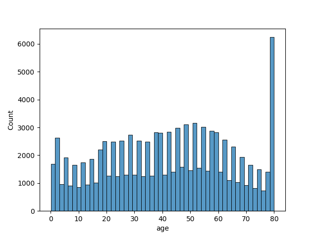

#### Data Kategorikal

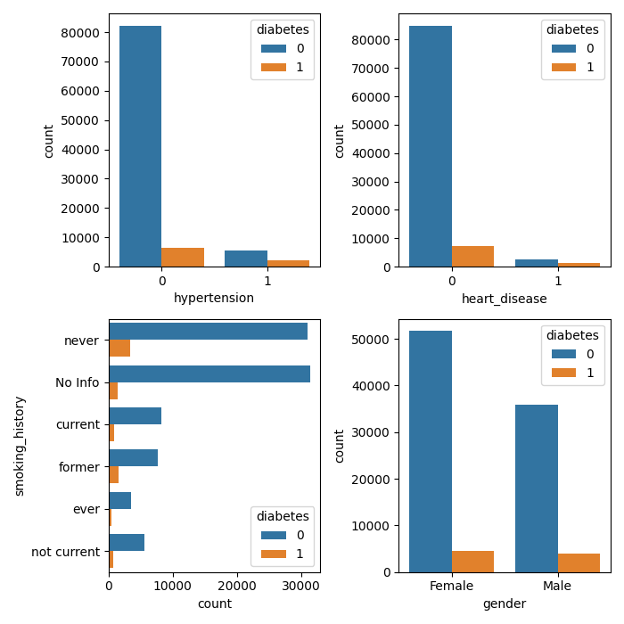

Dari visualisasi dataset di atas, tidak ada yang terlalu menyebabkan orang terkena diabetes. Memang tingkat orang yang tidak terkena *hypertension* atau penyakit jantung lebih tinggi tidak terkena diabetes, namun jumlah data yang terkena *hypertension* atau penyakit jantung lebih sedikit. Begitu juga dengan jenis kelamin dan riwayat merokok.

#### Data Numerikal

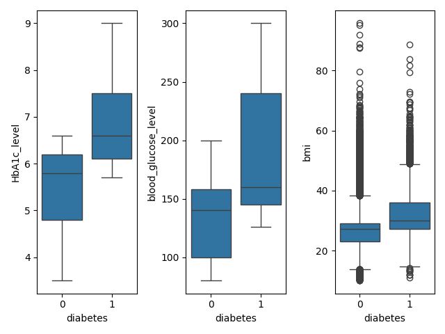

Berikut beberapa informasi yang dapat diambil:
- Orang dengan level Hemoglobin A1c di atas 6.5 dipastikan terkena diabetes. Namun ada beberapa orang dengan level Hemoglobin A1c di bawah 6.5 yang terkena diabetes.
- Orang dengan jumlah glukosa di atas 200 dipastikan terkena diabetes.
- Menurut data yang digunkakan, bmi atau jumlah perkiraan lemak pada tubuh tidak terlalu mempengaruhi diabetes, karena banyak juga pasien dengan bmi di atas 60 yang tidak terkena diabetes. 
- Kedua *features* ini adalah indikasi seseorang terkena diabetes atau tidak.

#### Heatmap

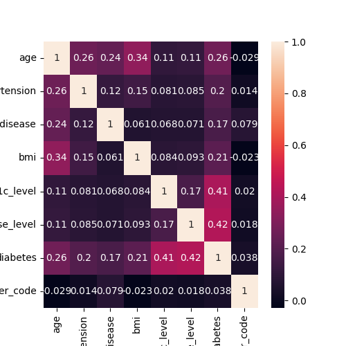

Di atas adalah heatmap korelasi/hubungan antara *feature* diabetes dengan fitur lainnya. Beberapa hasil yang didapat antara lain:
- Umur mempengaruhi berat badan, penyakit jantung, dan hypertensi, sehingga berdampak juga pada diabetes.
- Jenis kelamin tidak memiliki keterkaitan pada *feature* apapun.
- Level Hemoglobin dan Level Glukosa saling berkaitan satu sama lain.
- Penyakit diabetes sangat ditentukan oleh level hemoglobin dan level glukosa.

## 4. Data Preparation

Berikut adalah urutan data preparation yang digunakan dalam proyek:

#### Missing Value

Mengetahui apakah ada data yang kosong pada setiap kolom menggunakan kode isnull(), dan menjumlahkan data yang bernilai koson tersebut dengan perintah sum().
Missnig value sering kali menjadi hambatan dan menurunkan tingkat akurasi, karena data yang hilang merupakan data penting yang juga dipelajari oleh model.

#### Duplikasi Data

Menyeleksi apakah ada data yang memiliki nilai yang sama dengan data lain. Untuk mencari data yang terduplikasi ini, dilakukan dengan menggunakan perintah duplicated().
Setelah itu, jumlah data yang sama ini akan ditotalkan dan menampilkan jumlahnya dengan perintah sum().

Duplikasi juga salah satu kesalahan data yang dapat mempengaruhi model, diantaranya:
- Data duplikasi biasanya tidak menambah informasi baru untuk model, sehingga keberadaannya tidak meningkatkan kemampuan model dalam mengenali pola.
- Memperbesar risiko overfitting, terutama untuk model yang sangat kompleks (seperti Decision Tree atau Random Forest). Hal ini karena model cenderung "mengingat" pola yang sering muncul secara berulang, meskipun pola tersebut berasal dari data yang sama.

Diketahui juga jika bahwa data non-diabetes sudah jauh lebih dominan.
Total data non-diabetes: 91500 - 3836 = 87664
Total data diabetes: 8500 - 18 = 8482
Rasio kategori setelah penghapusan yaitu 87664/8482 = 1034/1
Sehingga, menghapus data duplikasi ini tidak akan signifikan mempengaruhi distribusi dataset. Hal ini justru membuat dataset menjadi lebih bersih dan membantu mengurangi bias terhadap kategori non-diabetes.

Oleh karena itu, semua data yang terduplikasi akan dihapus, dan hanya menyisakan 1 data saja. Adapun perintah untuk menghapusnya secara otomatis yaitu denagn drop_duplicated(inplace=True).

#### Menghapus Nilai Yang Tidak Sesuai

Pada kolom 'gender', terdapat nilai 'Other', yaitu jenis kelamin selain Laki-laki dan perempuan. Karena hanya ada 2 jenis kelamin data dengan 'gender' 'Other' akan dihapus. Dan karena data ini hanya ada 18, maka tidak akan mempengaruhi nilai data.

Kolom smoking_history di sini akan dihapus, karena smoking_history memiliki banyak pilihan yang kurang jelas, dan mungkin akan mempersulit pembelajaran model.

#### Mengubah Tipe Data

Setelah memperhatikan semua data, terdapat tipe data string/object, yaitu 'gender' dan 'smoking_history'. Untuk memudahkan kita dalam menentukan penyebab diabetes, dan juga memudahkan proses pembelajaran mesin, data string ini akan diubah menjadi integer.

Untuk mengubah gender, di sini menggunakan perintah .cat.codes. Setelah dilihat menggunakan main_df.gender.cat.categories, dapat dilihat bahwa '0' mewakili Female/Perempuan, dan '1' mewaliki Male/Laki-laki

#### Menghapus Kolom Yang Tidak Penting

Kolom smoking_history di sini akan dihapus, karena smoking_history memiliki banyak pilihan yang kurang jelas, dan mungkin akan mempersulit pembelajaran model.

Selanjutnya, agar dapat memilih kolom mana yang penting, yang pertama yaitu mencari nilai korelasi setiap feature dengan nilai diabetes menggunakan peerintah corr(). Proses ini dapat menggunakan berbagai macam cara, diantaranya:
- Membuat heatmat dengan memanfaatkan library seaborn dan matplotlib
- Membuat dataset baru dengan nama 'top_features' yang berisikan features dengan nilai korelasi di atas 0.19
- Agar terlihat lebih jelas, nilai korelasi dataset 'top_features' dibuatkan grafik batang dengan judul 'Correlation of Features with Diabetes'

Dari tingkat korelasi yang ada, diketahui bahwa 5 features tertinggi yaitu 'blood_glucose_level', 'HbA1c_level', 'age', 'bmi', 'hypertension', sehingga hanya ini yang akan kita buat sebagai data.
Tahapan ini dilakukan agar data yang dilatih oleh model adalah data yang benar-benar berguna, sehingga menghasilkan akurasi lebih tinggi.

#### Membagi Train dan Test

Sebelum memasuki tahap modeling, data perlu dibagi menjadi data training dan data test. Data training merupakan data yang digunakan untuk membangun sebuah model dan mendapatkan bobot yang sesuai. Sedangkan data testing digunakan untuk mengetahui tingkat keakuratan hasil dengan nilai sebenarnya.

Sebelum dibagi menjadi train dan test, data yang sudah siap dibagi menjadi label/feature (pada data ini yaitu: 'diabblood_glucose_level', 'HbA1c_level', 'age', dan 'bmi') dan target (hasil yang ingin diprediksi, yaitu 'diabetes')
Cara mudah membagi data yaitu dengan menggunakan train_test_split. Berikut adalah kode untuk meng*import*nya 

``` from sklearn.model_selection import train_test_split ```

target_size atau rasio yang digunakan untuk proyek ini yaitu 0.2 (80% data training, 20% data train). Rasio ini umum digunakan untuk memberikan keseimbangan antara memiliki jumlah data yang cukup untuk melatih model dan menyediakan data yang cukup untuk menguji performa model.

#### Menambahkan stratify=y pada train_test_split

`stratify=y` berfungsi untuk menyeimbangkan pembagian/distribusi kelas agar seimbang antara data latih dan uji. Karena, jika salah satu kelas kurang terwakili dalam data latih, model mungkin tidak akan terlatih dengan baik, karena tidak mampu belajar pola dari kelas tersebut.

Contohnya, jika dataset asli memiliki 90% kelas non-diabetes (kelas mayoritas) dan 10% kelas diabetes (kelas minoritas), maka data latih dan uji masing-masing juga akan memiliki proporsi yang sama (90:10).

#### Menangani Dataset Tidak Seimbang

Seperti yang sudah ditunjukan pada info dataset sebelumnya (atau pada penjelasan dupliaced data), dataset ini memiliki jumlah pasien diabetes sebanyak 91500 dan pasien yang tidak terkena diabetes sebanyak 8500. Artinya, data ini sangat tidak seimbang. Kondisi ini akan berdampak pada hasil model yang keseluruhan mungkin terlihat memiliki akurasi tinggi, tetapi sebenarnya model hanya memprediksi dengan baik untuk kelas mayoritas, dan lain masalah lainnya. Disinilah metode SMOTE dan Undersampling digunakan.

Metode SMOTE (Synthetic Minority Oversampling Technique) adalah teknik untuk menangani ketidakseimbangan data dengan mensintesis sampel baru atau menciptakan sampel baru yang lebih bervariasi untuk kelas minoritas berdasarkan tetangga terdekat dari data yang ada. Implementasi SMOTE dilakukan dengan library `imbalanced-learn`. Adapun Undersampling adalah menghapus sebagian data dari kelas mayoritas untuk menyeimbangkan distribusi.

Pada proyek ini, akan menggabungkan kedua metode ini untuk memastikan distribusi data yang lebih seimbang dengan mengurangi ukuran kelas mayoritas dan memperkaya variasi kelas minoritas, yaitu dengan SMOTE-Tomek. Berikut adalah cara kerja SMOTE-Tomek:
- Pertama, SMOTE digunakan untuk meningkatkan jumlah data pada kelas minoritas dengan cara membuat data sintetis.
- Setelah itu, Tomek digunakan untuk menghapus data mayoritas yang sangat dekat dengan data minoritas. Hal ini bertujuan untuk mengurangi noise dan meningkatkan pemisahan antara kedua kelas.

## 5. Modeling

Tujuan utama proyek ini dibuat yaitu mengelompokkan pasien ke dalam dua kategori: diabetes atau tidak diabetes, berdasarkan data kesehatan mereka. Artinya, proyek ini menggunakan *binary classification* (mengklasifikasikan nilai ke dalam dua kelas). Oleh karena itu, proyek ini akan mencoba menggunakan 2 jenis algoritma machine learning, yaitu `DecisionTreeClassifier` dan `GradientBoostingClassifier`.

### Decision tree

Decision tree adalah salah satu algoritma machine learning yang menggunakan struktur pohon (dari atas kebawah dengan banyak cabang), yang menggambarkan bagaimana mesin membuat keputusan berdasarkan serangkaian aturan dan kondisi.

#### Cara Kerja Decision tree

Decision tree terdiri dari:
- Root Node: Node awal yang merepresentasikan seluruh dataset.
- Decision Nodes / Interior Nodes: Node yang bercabang berdasarkan kondisi pada fitur tertentu.
- Leaf Nodes: Node akhir yang memberikan hasil prediksi atau nilai.

Berikut gambaran proses algoritma Decision Tree
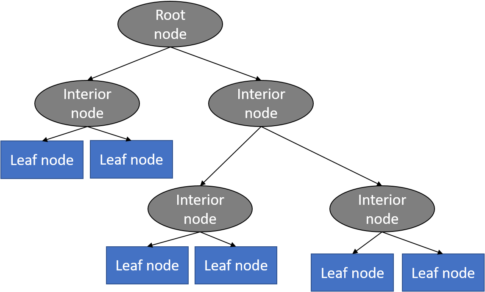

Awalnya, algoritma mengevaluasi semua fitur dan memilih fitur yang memberikan pembagian terbaik atau split terbaik berdasarkan *Gini Impurity* (untuk criterion "gini"), atau *Information Gain* (untuk criterion "entropy").
Berikut cara algoritma menghitung kualitas split
- Jika menggunakan Gini Impurity, Gini Impurity dihitung sebagai
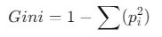
di mana p𝑖 adalah probabilitas kelas 𝑖. Split terbaik adalah yang meminimalkan nilai Gini Impurity.
- Jika menggunakan Entropy, Entropy dihitung sebagai
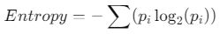
dan split terbaik adalah yang memaksimalkan Information Gain:
Information Gain = Entropy(parent) − weighted sum of Entropy(children)

Itu adalah pembuatan split pertama. Proses ini akan terus diulang secara otomatis dengan membuat node baru pada setiap hasil split, lalu node baru ini dipecah lagi berdasarkan split terbaik untuk fitur di subset tersebut.

Proses berhenti jika:
1. Semua data dalam subset termasuk ke dalam satu kelas.
2. Tidak ada lagi fitur untuk membagi dataset.
3. Kondisi pemberhentian seperti kedalaman maksimum pohon (max_depth) atau jumlah minimum sampel di daun (min_samples_leaf) terpenuhi.

Ketika pohon sudah selesai dibuat, data baru yang ingin diprediksi akan masuk ke dalam root node, lalu bergerak melalui cabang sesuai dengan kondisi pada setiap node. Ketika sampai di leaf node, hasil prediksi akan diberikan.Pada awal pengujian menggunakan algoritma ini, semua parameter diisi secara default.

#### Kelebihan dan Kekurangan Decision tree

Kelebihan:
- Decision tree dapat menangkap hubungan non-linear antara fitur (seperti BMI, level glukosa) dan label (risiko diabetes). Ini penting karena hubungan dalam data kesehatan sering tidak linier.
- Decision tree mudah dipahami oleh manusia karena bekerja dalam bentuk aturan if-else. Dokter atau stakeholder dapat memahami logika di balik prediksi, seperti "Jika BMI > 30 dan level glukosa > 140, maka risiko diabetes tinggi."
- Decision tree tidak memerlukan normalisasi atau standardisasi data, yang membuatnya ideal untuk data seperti rekam medis dengan skala yang berbeda.

Kekurangan:
- Decision tree cenderung overfitting jika tidak dilakukan pengaturan parameter seperti kedalaman maksimum (max_depth) atau jumlah minimum sampel di daun (min_samples_leaf)
- Rentan terhadap overfitting, terutama pada dataset kecil.

### Gradient Boosting

Algoritma Gradient Boosting bekerja dengan menggabungkan beberapa model yang lemah menjadi sebuah model yang lebih kuat. Model-model lemah ini sering disebut dengan weak learners, dan dapat berupa model regresi atau klasifikasi sederhana seperti Decision Tree.

Algoritma ini menggunakan pendekatan iteratif, di mana setiap iterasi, Gradient Boosting akan menambahkan weak learner baru dan mengoreksi prediksi sebelumnya dengan memperhitungkan kesalahan pada prediksi tersebut.
Proses ini dilakukan secara berulang-ulang hingga model yang dihasilkan memenuhi kriteria tertentu, seperti nilai loss function yang cukup kecil.

#### Cara Kerja Gradient Boosting

Gradient Boosting dimulai dengan model awal yang sederhana. Setiap iterasi, akan melakukan berbagai langkah berikut
1. Menghitung error (residual), yaitu selisih antara nilai target sebenarnya dan prediksi model saat ini. Residu dihitung menggunakan gradien fungsi loss.
2. Sebuah model baru (decision tree kecil atau *weak learner*) dilatih untuk memprediksi residual tersebut.
3. Prediksi model baru ditambahkan ke model ansambel dengan bobot tertentu
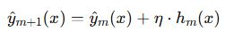
di mana ℎ<sub>𝑚</sub>(𝑥) adalah model baru pada iterasi 𝑚, dan 𝜂 adalah learning rate yang mengontrol kontribusi model baru.
4. Update prediksi, yaitu kombinasi dari semua model sebelumnya.

Langkah ini akan terus diulangi sehingga jumlah iterasi maksimum tercapai, atau model mencapai peforma optimal pada data validasi. Pada awal pengujian menggunakan algoritma ini, semua parameter diisi secara default.

#### Kelebihan dan Kekurangan Gradient Boosting

Berikut adalah kelebihan algoritma Gradien Boosting:
- Gradient boosting adalah model  menggabungkan banyak pohon keputusan sederhana (weak learners) untuk membuat prediksi yang kuat. Hal ini menjadikannya lebih akurat dibandingkan model sederhana seperti single decision tree.
- Gradient boosting juga memiliki hyperparameter seperti `learning_rate` dan `subsample` yang membantu mengurangi risiko overfitting, sehingga lebih baik dalam generalisasi dibandingkan decision tree tunggal.
- Gradient boosting dapat menangkap hubungan non-linear dan interaksi antara fitur, yang penting dalam prediksi diabetes, di mana faktor seperti BMI dan kadar glukosa saling memengaruhi risiko.

Berikut adalah kekurangan algoritma Gradien Boosting:
- Algoritma ini memerlukan tuning parameter yang cermat untuk mendapatkan model yang optimal. Hal ini dapat memakan waktu dan mengharuskan penggunaan cross-validation dan teknik tuning parameter lainnya.
- Gradient Boosting dapat cenderung overfit pada data training jika tidak dilakukan pengaturan parameter yang baik. 
- Gradient Boosting memerlukan jumlah data yang besar untuk memperoleh model yang akurat dan stabil. Jika jumlah data terlalu sedikit, algoritma ini dapat menjadi tidak stabil dan menghasilkan model yang tidak akurat.

### Improvement dengan RandomizedSearchCV 

RandomizedSearchCV adalah salah satu teknik hyperparameter tuning untuk menemukan kombinasi parameter terbaik pada suatu model machine learning. Teknik ini bekerja secara acak mencoba berbagai kombinasi parameter yang ditentukan dalam suatu ruang pencarian. Dengan demikian, RandomizedSearchCV dapat membantu kita menemukan parameter optimal yang dapat meningkatkan kinerja model dalam waktu lebih singkat dibanding hyperparameter tuning lainnya.

Berikut adalah cara kerja RandomizedSearchCV:
- Menentukan rentang nilai atau distribusi probabilitas untuk setiap hyperparameter yang ingin dioptimalkan.
- Algoritma secara acak memilih kombinasi parameter dari ruang pencarian yang telah ditentukan.
- Model dilatih dengan menggunakan kombinasi parameter yang dipilih dan dievaluasi menggunakan metrik yang relevan (accuracy).
- Proses sampling dan evaluasi diulang sebanyak yang ditentukan, atau hingga mencapai kriteria berhenti yang telah ditetapkan.
- Setelah semua iterasi selesai, model dengan kinerja terbaik (berdasarkan metrik evaluasi) akan dipilih sebagai model akhir.

Berikut penjelasan dictionary `param_distributions` dalam hyperparameter yang akan dicoba.
- `learning_rate: uniform(0.01, 0.3)`: Langkah setiap iterasi dipilih secara acak antara nilai desimal 0.01 sampai 0.3.
- `n_estimators: randint(10, 15)`: Jumlah pohon yang akan dibangun dipilih secara acak antara 10 sampai 15.
- `max_depth: randint(3, 10)`: Membatasi kedalaman maksimum pohon untuk mencegah overfitting, dipilih secara acak antara 3 sampai 10.
- `max_depth: [3, 5, 10, None]`: Membatasi kedalaman maksimum pohon untuk mencegah overfitting, antara 3, 5, 10, dan kosong.
- `min_samples_split`: Jumlah minimum sampel yang dibutuhkan untuk membagi sebuah node. `randint(2, 20)` artinya dipilih secara acak bilangan bulat antara 2 sampai 20.
- `min_samples_leaf`: Jumlah minimum sampel yang harus ada di setiap daun. `randint(1, 19)` artinya dipilih secara acak bilangan bulat antara 1 sampai 10.
- `criterion`: Fungsi untuk mengukur kualitas split, yaitu antara menggunakan *gini* atau *entropy*.
- `subsample`: Rasio sampel yang digunakan untuk membangun setiap pohon.
`uniform(0.6, 0.4)` artinya dipilih secara acak bilangan desimal antara 0.6 sampai 0.4

Selanjutnya adalah proses pencarian kombinasi hyperparameter terbaik melalui RandomizedSearchCV:
- `estimator`: Model yang akan dituning, dalam hal ini adalah DecisionTreeClassifier.
- `param_distributions`: Distribusi hyperparameter yang akan dipilih secara acak.
- `n_iter=10`: Jumlah kombinasi hyperparameter yang akan diuji (10 kombinasi acak).
- `cv=5`: Dataset dilatih dan divalidasi menggunakan 5-fold cross-validation.
- `scoring='f1_macro'`: Metrik evaluasi yang cocok untuk klasifikasi multikelas atau dataset yang tidak seimbang.
- `n_jobs=-1`: Menjalankan pencarian secara paralel di semua prosesor yang tersedia untuk mempercepat proses.
- `random_state=42`: Menentukan seed untuk pengacakan, sehingga hasil dapat direproduksi.

### Perbandingan DecisionTreeClassifier vs GradientBoostingClassifier

| **Kriteria**                | **DecisionTreeClassifier**                        | **GradientBoostingClassifier**                  |
|------------------------------|--------------------------------------------------|------------------------------------------------|
| **Kecepatan Pelatihan**      | Cepat, cocok untuk eksperimen awal.              | Lebih lambat karena membangun model ansambel.  |
| **Kemampuan Interpretasi**   | Sangat mudah diinterpretasi.                     | Sulit diinterpretasi karena ansambel pohon.    |
| **Kemampuan Generalisasi**   | Rentan terhadap overfitting tanpa regularisasi.  | Lebih baik dalam generalisasi (dengan tuning). |
| **Kemampuan Menangkap Kompleksitas** | Terbatas pada hubungan sederhana.              | Dapat menangkap hubungan kompleks.             |
| **Dataset Imbang vs Tidak**  | Kurang optimal untuk data tidak seimbang.        | Lebih cocok untuk data tidak seimbang.         |
| **Kebutuhan Hyperparameter Tuning** | Minimal, cukup dengan pengaturan dasar.          | Membutuhkan tuning hyperparameter untuk hasil optimal. |
| **Akurasi pada Dataset Besar** | Cukup baik, tetapi terbatas.                     | Lebih akurat, terutama pada dataset besar.     |
| **Waktu Prediksi**           | Cepat.                                           | Relatif lebih lambat karena banyak pohon.      |
| **Kemampuan Menangani Noise**| Rentan terhadap noise tanpa pruning.            | Lebih tahan terhadap noise dengan regularisasi. |


## 6. Evaluation

Metrik evaluasi yang digunakan adalah sebagai berikut:

### Accuracy

*Accuracy* adalah metric yang mengukur seberapa sering model machine learning memprediksi keluaran hasil secara tepat. Hasil akurasi ini adalah pembagian prediksi yang benar dengan jumlah seluruh data.

Hasil akurasi ini berada diantara angka 0 dan 1. Semakin besar nilai akurasi, maka semakin baik model yang dibuat. Artinya, jika hasil accuracy bernilai 1, maka model mampu memprediksi seluruh data tanpa satupun kesalahan.

Untuk menghitung nilai akurasi, menggunakan rumus berikut:
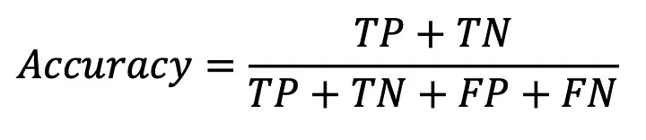
- TP = True Positive (Model memprediksi dengan benar bahwa data bernilai positive)
- TN = True Negative (Model memprediksi dengan benar bahwa data bernilai negative)
- FP = False Positive (Model memprediksi dengan salah bahwa data bernilai positive)
- FN = False Negative (Model memprediksi dengan salah bahwa data bernilai negative)

Hasil *accuracy* yang ditunjukan pada akhir pembuatan model, baik menggunakan model DecisionTreeClassifier atau GradientBoostingClassifier adalah 0.97.

### Recall

Recall/Sensitivitas adalah metrik evaluasi yang menggambarkan seberapa baik suatu model dalam mengidentifikasi positif dengan benar.

Sebagai analogi, bayangkan kita sedang mencari jarum di tumpukan jerami. Recall menggambarkan seberapa baik kita menemukan semua jarum yang ada di tumpukan tersebut. Jika kita menemukan 6 dari 10 dari jarum ditumpukan Jerami tersebut, artinya kita masih melewatkan 4 jarum yang belum ditemukan.

Dalam proyek ini, recall ini sangat penting, karena biaya salah mendiagnosis pasien positif (false negative) lebih tinggi. Contoh, pasien yang seharusnya menjalani pengobatan karena diabetes malah memakan makanan manis yang memperburuk penyakit diabetesnya.

Untuk menghitung recall, Anda dapat membagi jumlah true positive dengan jumlah contoh positif. Semakin tinggi recall, semakin banyak positif yang terdeteksi.
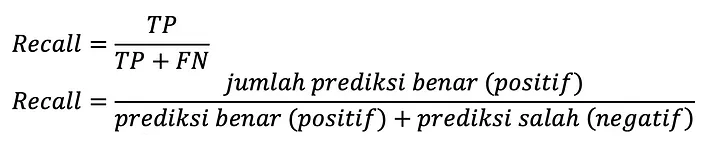

Hasil *recall* yang ditunjukan pada akhir pembuatan model, baik menggunakan model DecisionTreeClassifier adalah 1.00 dan 0.67, dan GradientBoostingClassifier adalah 1.00 dan 0.68.

### Precision

Precision/Presisi adalah metrik yang mengukur seberapa sering model pembelajaran mesin memprediksi kelas positif dengan benar.
Presisi dihitung dengan membagi jumlah prediksi positif yang benar (positif benar) dengan jumlah total prediksi positif (positif benar ditambah positif salah).
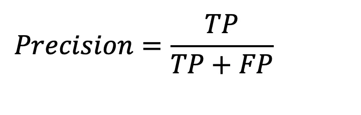

Hasil *accuracy* yang ditunjukan pada akhir pembuatan model, baik menggunakan model DecisionTreeClassifier adalah 0.97 dan 1.00, dan GradientBoostingClassifier adalah 0.97 dan 0.99.

### f1-score

F1-Score adalah metrik evaluasi performa model yang digunakan dalam masalah klasifikasi, terutama ketika data tidak seimbang. F1-Score menggabungkan dua metrik utama: Precision dan Recall ke dalam satu nilai harmonis.

F1-Score dihitung dengan rumus berikut:

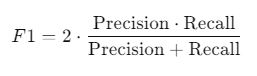

Hasil *accuracy* yang ditunjukan pada akhir pembuatan model, baik menggunakan model DecisionTreeClassifier atau GradientBoostingClassifier adalah 0.98 dan 0.80.

### Hasil Kinerja Keseluruhan

**DecisionTreeClassifier + RandomizedSearchCV**

| Class         | Precision | Recall | F1-Score | Support |
|---------------|-----------|--------|----------|---------|
| **0**        | 0.97      | 1.00   | 0.98     | 26,294  |
| **1**        | 1.00      | 0.67   | 0.80     | 2,545   |
| **Accuracy** |           |        | 0.97     | 28,839  |
| **Macro Avg**| 0.98      | 0.83   | 0.89     | 28,839  |
| **Weighted Avg**| 0.97   | 0.97   | 0.97     | 28,839  |

**GradientBoostingClassifier + RandomizedSearchCV**

| Class         | Precision | Recall | F1-Score | Support |
|---------------|-----------|--------|----------|---------|
| **0**        | 0.97      | 1.00   | 0.98     | 26,294  |
| **1**        | 0.99      | 0.68   | 0.80     | 2,545   |
| **Accuracy** |           |        | 0.97     | 28,839  |
| **Macro Avg**| 0.98      | 0.84   | 0.89     | 28,839  |
| **Weighted Avg**| 0.97   | 0.97   | 0.97     | 28,839  |


Berdasarkan metrik yang diberikan, kita dapat menyimpulkan hal berikut:
- Kedua model memiliki precision tinggi untuk kelas 1 (1.00 pada DecisionTreeClassifier dan 0.99 pada GradientBoostingClassifier). Artinya, model sangat baik dalam menghindari false positives (FP) pada kelas 1.
- Recall untuk kelas 1 adalah 0.67 pada DecisionTreeClassifier dan 0.68 pada GradientBoostingClassifier. Artinya, GradientBoostingClassifier sedikit lebih baik dalam mendeteksi semua kasus positif dibandingkan DecisionTreeClassifier.
- F1-Score untuk kelas 1 adalah 0.80 untuk kedua model, menunjukkan performa yang seimbang antara precision dan recall.
- GradientBoostingClassifier memiliki Macro Avg Recall sedikit lebih tinggi (0.84) dibandingkan DecisionTreeClassifier (0.83), yang menunjukkan performa lebih baik untuk kedua kelas secara keseluruhan.
- *accuracy* kedua model sama: 97%, menunjukkan performa keseluruhan yang baik.
- *Weighted Avg* menunjukkan bahwa model menangani ketidakseimbangan data dengan baik karena mempertimbangkan kontribusi dari kedua kelas.

### Confusion Matrix

Confusion matrix adalah sebuah tabel yang digunakan untuk mengevaluasi performa model klasifikasi. Tabel ini membandingkan prediksi model dengan nilai aktual (ground truth) dari data. Dengan kata lain, confusion matrix menunjukkan seberapa baik model kita dalam mengklasifikasikan data ke dalam kelas yang benar.

Berikut adalah hasil confusion matrix kedua model

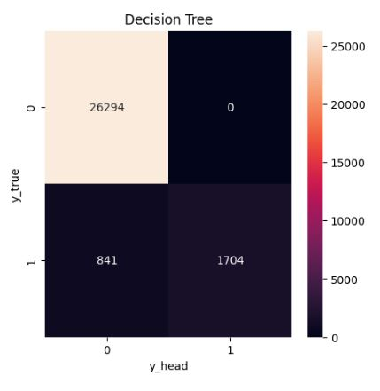

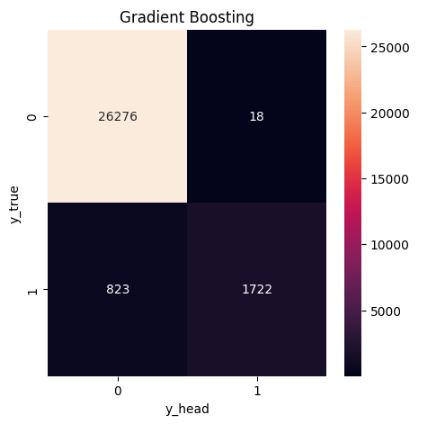

**Confusion Matrix Decision Tree**
-True Positives (TP): 1,704. Pasien yang benar-benar memiliki diabetes dan berhasil diprediksi dengan benar.
- True Negatives (TN): 26,294. Pasien yang tidak memiliki diabetes dan diprediksi dengan benar sebagai tidak memiliki diabetes.
- False Positives (FP): 0. Tidak ada pasien yang salah diprediksi sebagai memiliki diabetes padahal sebenarnya tidak memiliki.
- False Negatives (FN): 841. Sebanyak 841 pasien yang memiliki diabetes gagal terdeteksi.

**Confusion Matrix Gradient Boosting**
- True Positives (TP): 1,722. Pasien yang benar-benar memiliki diabetes dan berhasil diprediksi dengan benar.
- True Negatives (TN): 26,276. Pasien yang tidak memiliki diabetes dan diprediksi dengan benar sebagai tidak memiliki diabetes.
- False Positives (FP): 18. Sebanyak 18 pasien salah diprediksi sebagai memiliki diabetes padahal sebenarnya tidak memiliki.
- False Negatives (FN): 823. Sebanyak 823 pasien yang memiliki diabetes gagal terdeteksi.

## Kesimpulan

### Model Terbaik

Kedua model memberikan hasil evaluasi yang sangat baik, tetapi GradientBoostingClassifier adalah pilihan terbaik dalam skenario ini karena performa yang sedikit lebih baik dalam menangani kelas minoritas.

GradientBoostingClassifier dianggap lebih baik untuk tugas ini karena memiliki recall yang sedikit lebih tinggi (0.68 vs 0.67) dan macro average recall lebih baik (0.84 vs 0.83). Recall yang lebih tinggi pada kelas minoritas (kelas 1) sangat penting untuk meminimalkan false negatives (FN), terutama dalam konteks deteksi diabetes di mana kesalahan deteksi dapat berdampak serius.

### Evaluasi terhadap Business Understanding

Pada akhir proyek ini, problem statements belum tuntas terselesaikan. Berikut penjelasannya:

Proyek ini berhasil mengembangkan model machine yang dapat memprediksi pasien dengan risiko diabetes tinggi berdasarkan data usia, BMI, level glukosa, dan hemoglobin dengan nilai akurasi akurasi di atas 85%, seperti yang diharapkan.

Ini berhasil berkat pra-pemrosesan data yang membersihkan data sebelum digunakan, dan menggunakan metode SMOTE-Tomek untuk mengatasi ketidakseimbangan kelas. Pemilihan algoritma machine learning yang ditunjang dengan hyperparameter tuning RandomizedSearchCV juga membantu meningkatkan akurasi model.

Namun model belum dapat menampilkan rekomnedasi kegiatan, aktivitas, atau makanan bagi pasien. Pembuatan antarmuka interaktif dengan bahasa python memiliki banyak keterbatasan. Untuk menyelesaikan *goal* kedua ini, dibutuhkan gabungan dengan bahasa pemrograman lain yang membuat user lebih mudah memasukan input.

Oleh karena itu, proyek ini hanya sukses menyelesaikan 1 *goal*, dan menyisakan 1 *goal* lain yang belum terselesaikan.
